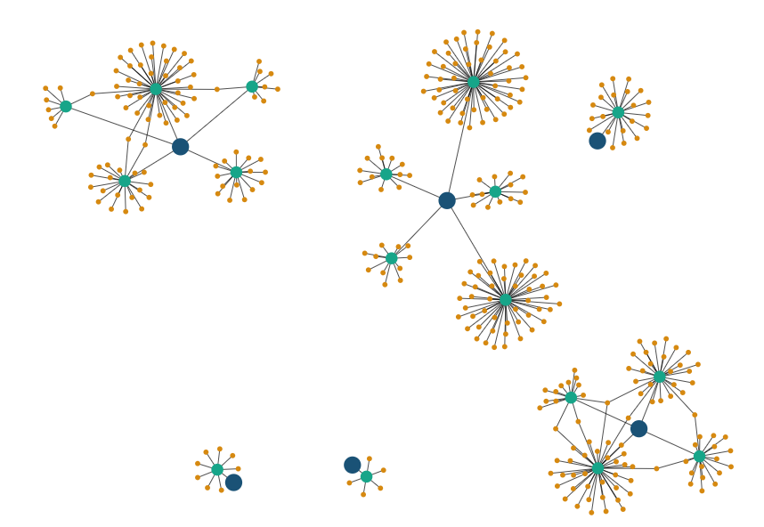
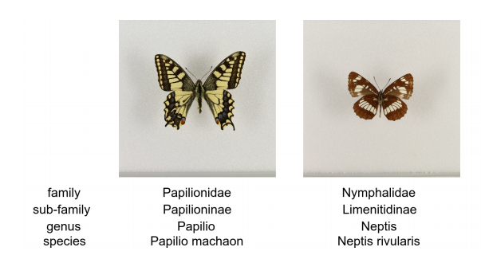
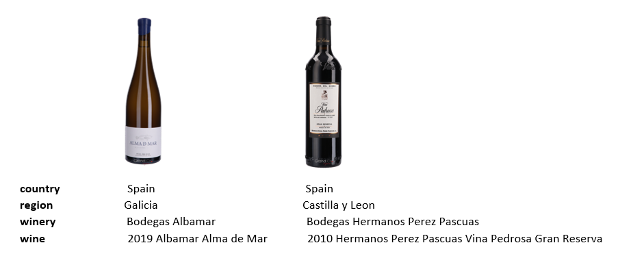
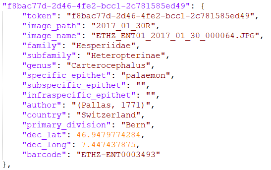
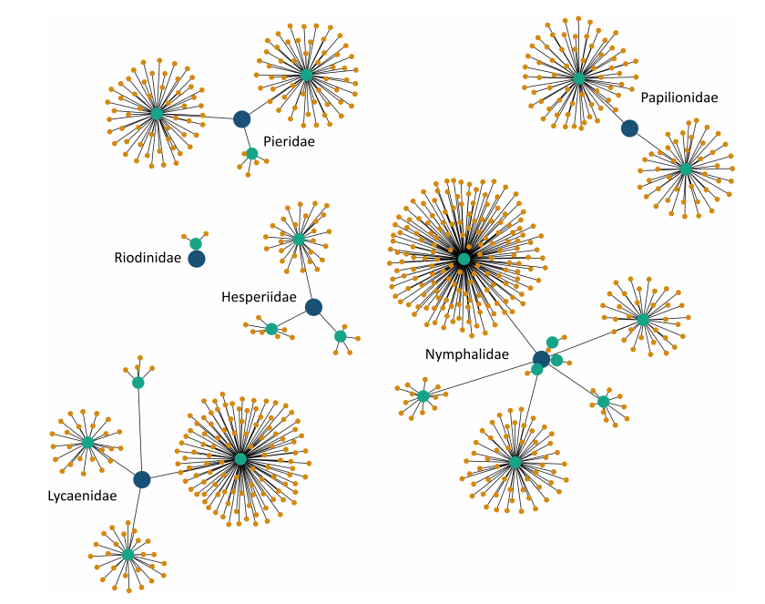
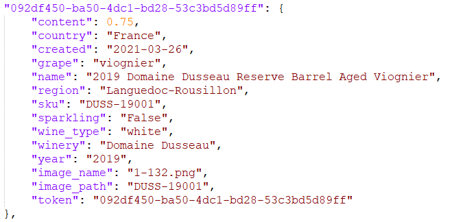
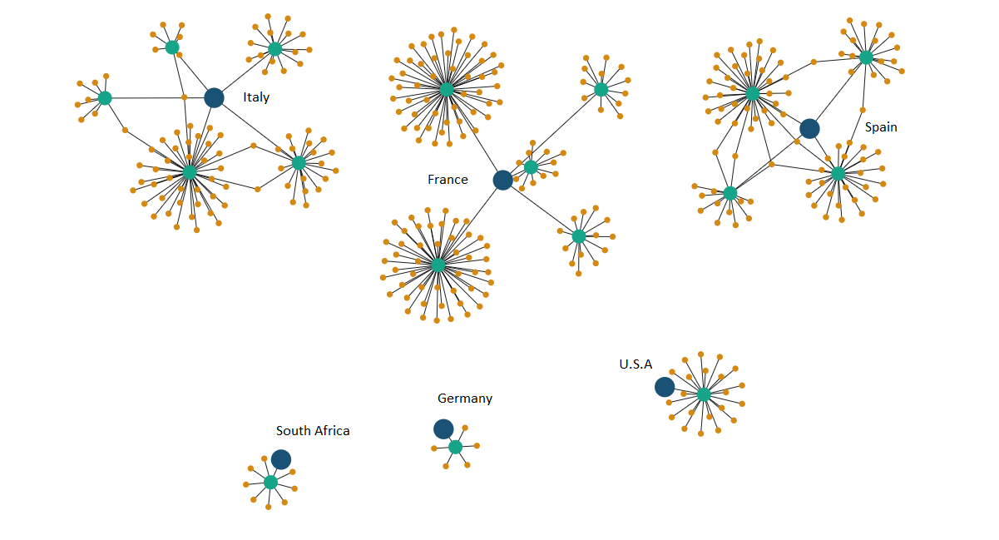

# CS4240 Reproducibility Project: Hierarchical Image Classification using Entailment Cone Embeddings

 

## Authors

 - Jasper Ketelaar, [@student.tudelft.nl](@student.tudelft.nl), 4453050  
 - Aayush Singh, [a.singh-28@student.tudelft.nl](a.singh-28@student.tudelft.nl), 5208122
 
## Introduction

The paper by A. Dhall et al. [1] presents a set of methods for leveraging information about the semantic hierarchy embedded in class labels. They argue that there has been limited work in using unconventional, external guidance other than traditional image-label pairs for training. They model the label-label and label-image interactions using order-preserving embeddings governed by both Euclidean and hyperbolic geometries, prevalent in natural language, and tailor them to hierarchical image classification and representation learning. They empirically validate the models on the hierarchical ETHEC dataset. Here is the image below provided by the authors describing the hierarchy of the dataset:

_Figure 1: Sample images and their 4-level labels from the ETHEC dataset._

The paper has used different ways to formulate probability distributions to pass hierarchical information like:
- Hierarchy-agnostic baseline classifier (HAB)
- Per-level Classifier
- Marginalization
- Masked Per-level classifier
- Hierarchical Softmax

We aim to reproduce the results shown in the paper. First we tried to replicate the results from the ETHEC dataset as used in the paper and then we used a new dataset of wine bottles. Here is the image below describing the hierarchy of our wine dataset:

_Figure 2: Sample images and their 4-level labels from our wine dataset._

## Datasets

- ETH Entomological Collection (ETHEC) Dataset

The ETHEC dataset used in the paper contains 47,978 images of the “order” Lepidoptera with corresponding labels across 4 different levels. Each image is of size 448x448 pixels. The division of the dataset is like: train(80%), validation(10%) and test(10%) based solely on the images. Here is the image below describing the information mentioned for each image in the json files:

_Figure 3: Information for each image in the Json files for the ETHEC dataset, as given by the authors of the paper._

_Figure 4 (paper Figure 1): Hierarchy of labels from the ETHEC dataset across 4 levels: family (blue), sub-family (aqua), genus (brown) and species. For clarity, this visualisation depicts only the first 3 levels. The name of the family is displayed next to its sub-tree. Edges represent direct relations_

- Wine Bottle Collection Dataset

The wine dataset, used to reproduce the results, contains 38893 images with corresponding labels across 4 different levels. Each image is kept of the same dimension (448x448 pixels) as the original ETHEC dataset used in the paper. The split of the data is also maintained the same: train(80%), validation(10%) and test(10%) based solely on the images. Here is the image below describing the information mentioned for each image in the json files:

_Figure 5: Information for each image in the Json files for the Wine dataset._

_Figure 6: Hierarchy of labels from the Wine dataset across 4 levels: country (blue), region (aqua), winery (brown) and wine. For clarity, this visualisation depicts only the first 3 levels. The name of the country is displayed next to its sub-tree. Edges represent direct relations_

## Methodology

During dataset creation various transformations were employed.

## Results

The results presented below are our effort to reproduce the paper. The original results from are also mentioned as a reference, along with the results obtained from our experiments on the ETHEC data set and the Wine dataset. The scores shown in the table are micro-averaged F1 scores which is calculated as F1 = (2*P*R)/(P + R) (with P being the precision and R being recall). A micro-averaged score for a metric is calculated by accumulating contributions (to the performance metric) across all labels and these accumulated contributions are used to calculate the micro score.

| | m-F1 | L1 | L2 | L3 | L4 |   
| --- | --- | --- | --- | --- | --- |
| ETHEC dataset | --- | --- | --- | --- | --- |
| **HS (Paper)** | 0.9180 | 0.9879 | 0.9731 | 0.9253 | 0.7855 |   
| **HS (Our Result)** | 0.6427 | 0.7316 | 0.7230 | 0.6927 | 0.5892 |
| **MC (Paper)** | 0.9223 | 0.9887 | 0.9758 | 0.9273 | 0.7972 |
| **MC (Our Result)** | 0.6061 | 0.6807 | 0.6749 | 0.6136 | 0.4801 |
| Wine dataset | --- | --- | --- | --- | --- |
| **HS** |  |  |  |  |  |
| **MC** |  |  |  |  |  |

_Table 1: Results obtained from experiments._

Looking at the results for the ETHEC dataset, we concluded that the setting in which we ran the experiments were not appropriate. We believe the low scores in comparison to those in paper is mainly due limited number of epochs used in our experiments. Due to high execution time and memory consumption, we had to limit the number of epochs to 10.

TODO: Mention something about our dataset results.

## Conclusion

## References
- \[1\]: Ankit Dhall, Anastasia Makarova, Octavian Ganea, Dario Pavllo, Michael Greeff, & Andreas Krause (2020). Hierarchical Image Classification using Entailment Cone Embedding. 

- \[2\]: A. Dhall (2019). Learning Representations For Images With Hierarchical Labels.

- \[3\]: A. Dhall (2019), Eth entomological collection (ethec) dataset  https://www.researchcollection.ethz.ch/handle/20.500.11850/365379 .

## Work Division

During the entire course of this project, we worked in a collaborative manner. Initially, we had discussions regarding which paper to reproduce and what dataset should we utilize. Then we focused on understanding the original paper and had discussions among ourselves and with the teaching assistant. Below the task division between the group members is shown:

### Jasper Ketelaar
- First Point

### Aayush Singh
- First Point

