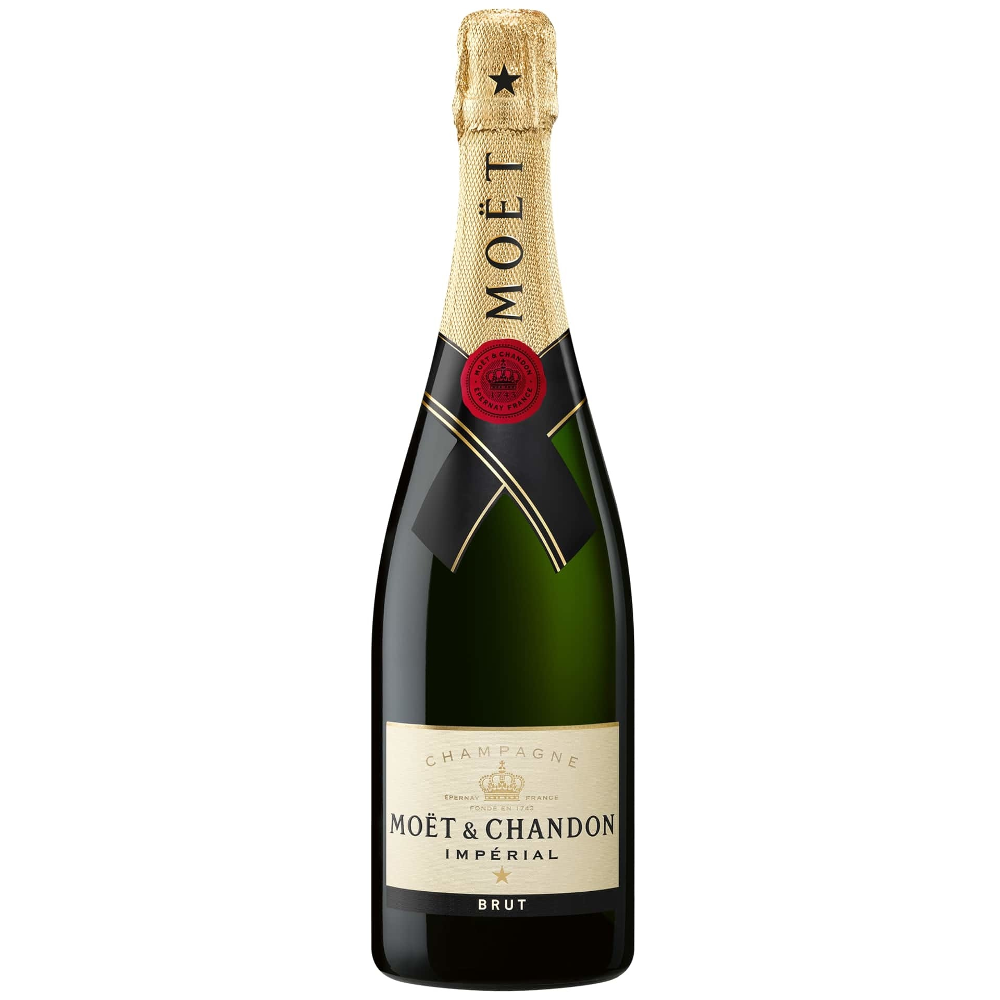
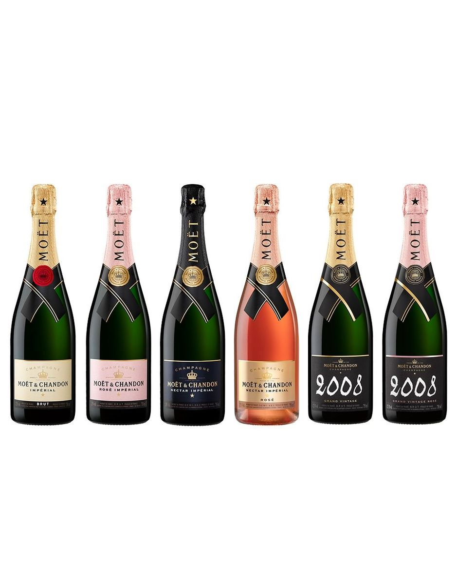
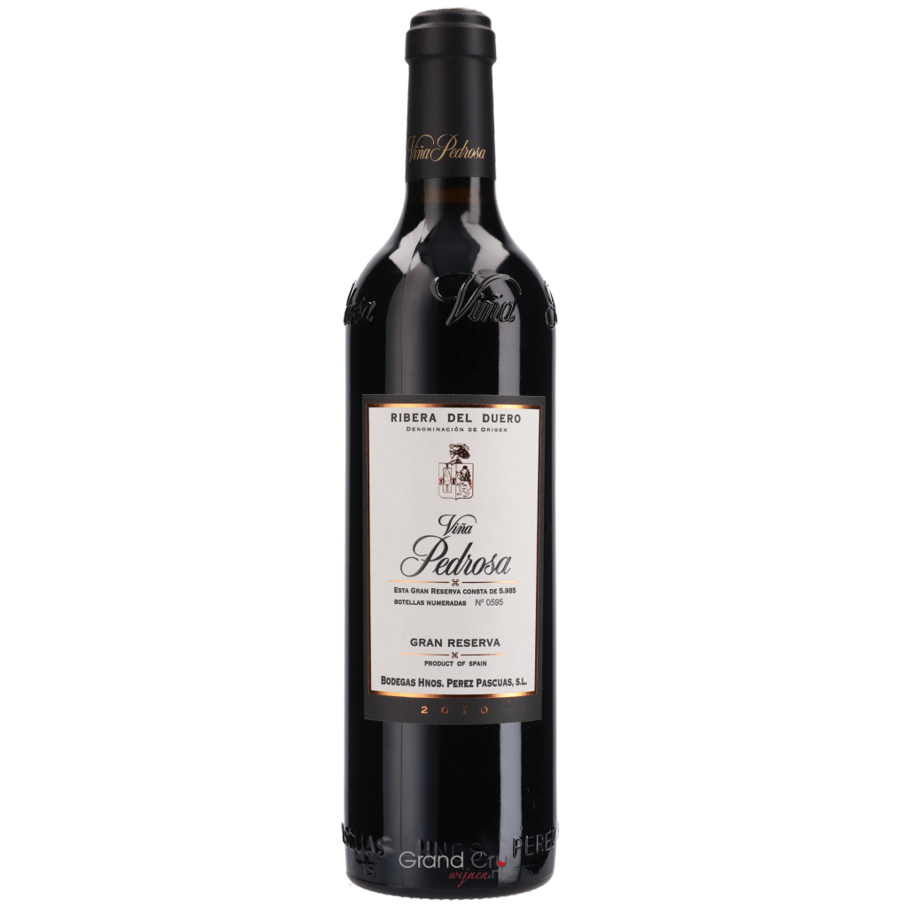
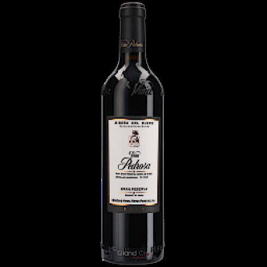

# CS4240 Reproducibility Project: Hierarchical Image Classification using Entailment Cone Embeddings

 

## Authors

 - Jasper Ketelaar, [j.ketelaar@student.tudelft.nl](j.ketelaar@student.tudelft.nl), 4453050  
 - Aayush Singh, [a.singh-28@student.tudelft.nl](a.singh-28@student.tudelft.nl), 5208122
 
## Introduction

The paper by A. Dhall et al. [1] presents a set of methods for leveraging information about the semantic hierarchy embedded in class labels. They argue that there has been limited work in using unconventional, external guidance other than traditional image-label pairs for training. They model the label-label and label-image interactions using order-preserving embeddings governed by both Euclidean and hyperbolic geometries, prevalent in natural language, and tailor them to hierarchical image classification and representation learning. They empirically validate the models on the hierarchical ETHEC dataset [2]. Here is the image below provided by the authors describing the hierarchy of the dataset:

_Figure 1: Sample images and their 4-level labels from the ETHEC dataset._

The paper has used different ways to formulate probability distributions to pass hierarchical information like:
- Hierarchy-agnostic baseline classifier (HAB)
- Per-level Classifier
- Marginalization
- Masked Per-level classifier
- Hierarchical Softmax

We aim to reproduce the results shown in the paper by using the existing code (making some changes as required to fit our dataset). First we tried to replicate the results from the ETHEC dataset as used in the paper and then we used a new dataset of wine bottles. Here is the image below describing the hierarchy of our wine dataset:

_Figure 2: Sample images and their 4-level labels from our wine dataset._

## Datasets

- ETH Entomological Collection (ETHEC) Dataset

The ETHEC dataset used in the paper contains 47,978 images of the “order” Lepidoptera with corresponding labels across 4 different levels. Each image is of size 448x448 pixels. The division of the dataset is like: train(80%), validation(10%) and test(10%) based solely on the images. Here is the image below describing the information mentioned for each image in the json files:

_Figure 3: Information for each image in the Json files for the ETHEC dataset, as given by the authors of the paper._

_Figure 4 (paper Figure 1): Hierarchy of labels from the ETHEC dataset across 4 levels: family (blue), sub-family (aqua), genus (brown) and species. For clarity, this visualisation depicts only the first 3 levels. The name of the family is displayed next to its sub-tree. Edges represent direct relations_

[comment]: <> (
--batch_size 32 --experiment_name gcw_exp_3 --experiment_dir gcw --image_dir F:\PycharmProjects\wineset-collector\transforms --n_epochs 4 --model resnet18 --loss last_level --set_mode train --level_weights 1.0 1.0 1.0 1.0 --lr 0.002
--batch_size 32 --experiment_name gcw_exp_2 --experiment_dir gcw --image_dir F:\PycharmProjects\wineset-collector\transforms --n_epochs 4 --model resnet18 --loss hsoftmax --set_mode train --level_weights 1.0 1.0 1.0 1.0 --lr 0.002
)

- Wine Bottle Collection Dataset

The images of the bottles come from a large collection of images that are used to be displayed on the product page
of a webshop. These images are taken from 12 angles to give the user a 360 degree experienece. They are also taken at an 
extremely high resolution after which they are scaled down to different resolutions for zooming in and to make loading times
faster when a high resolution is not required.

We used this dataset for our reproduction because we knew that there were certain levels of hierarchy in the shape, label, the fonts used and more.
To give an example, bottles from the entirety of France usually follow a certain
label structure and even within specific regions there are guidelines that the wineries follow. Moreover, the wineries themselves will often
produce recognizable features within their bottles to create a brand and have people be familiar with it. Most people know what a bottle of
Moët looks like if they are even slightly familiar with wine because their branding has become very popular over the years.

A single bottle of Moët if your interest does not lie in wines: 

_Figure 5: A bottle of a popular brand that produces champagnes_
 

Here is a line-up of a few of their bottles to show case what we meant by similarity and hierarchy:

_Figure 6: A collection of these bottles to show how the hierarchy was interpreted_

We figured that because these image based hierarchical attributes should be able to identify a bottle, this could be a very good dataset to work with a geometry based
model in general. Upon encountering the paper we actually realized that this could yield fantastic results as it, in essence but obviously more detail,
researched the topic and came up with a multitude of models to be used for data such as ours. We both, individually, picked 3 papers to make sure 
our preferences were met and this paper instantly ended up in both top 1 for the same reason.

To make the reproduction we knew a lot had to be done for the images of the bottles to make them fit the hierarchy defined
in the dataset used in the paper, so a lot of our time ended up going in to making sure that these bottles were collected,
filtered, scaled, transformed in certain ways and ended up creating a similar split sa the paper did.

In the end, our dataset contained 38893 images with corresponding labels across 4 different levels before we could
start working on the reproduction part of the results. 

Here is the image below describing the information mentioned for each image in the json files:

_Figure 7: Information for each image in the Json files for the Wine dataset._

_Figure 8: Hierarchy of labels from the Wine dataset across 4 levels: country (blue), region (aqua), winery (brown) and wine. For clarity, this visualisation depicts only the first 3 levels. The name of the country is displayed next to its sub-tree. Edges represent direct relations_

## Methodology

Initially, the existing code was used to replicate results reported in the paper. For executing experiments in different settings certain parameter were required to be modified. We executed experiment in the default parameter setting and some of important parameter worth mentioning are: batch_size = 64, learning rate = 0.00001, optimizer_method=adam, n_epochs=10, weight_strategy = inv, model = resnet50. Apart from these parameters, it had a parameter to choose the loss function (--loss). The options were like:
- 'multi_label' for Hierarchy-agnostic baseline classifier (HAB)
- 'multi_level' for Per-level Classifier
- 'last_level' for Marginalization
- 'masked_loss' for Masked Per-level classifier
- 'softmax' for Hierarchical Softmax

For the wine dataset, some changes were required to the existing code, json files had to be generated for train and test purposes, and image transformations were required to create some noise in the image and to make the dataset comparable in size to the ETHEC dataset used in the paper. Firstly, from the entire wine dataset only those data points were collected were there were images available and the parents in the hierarchy had some minimum number of children. Also, six different angles of wine bottle images were selected. After downloading the images as per the decided criteria, these images were transformed. Originally images were of different size, so these images were scaled up or down to 448x448 pixels, as per requirement. Then, the images were introduced to some gaussian noise and the changes can be seen in the images below:

### Creating the hierarchy
We needed to then create a hierarchy of the bottles to make sure that underrepresented values were filtered out and that we kept a structure relatively
similar to the data used in the paper. Once this hierarchy was constructed we dropped from ~1800 entries to ~1300 entries of bottles which we were satisfied with. 
This generated a json file that was used for the next part.

### Collecting the originals
Since the dataset had pictures of bottles that were taken from 12 different angles and had different resolutions the first step was collecting the originals. This turned out
to be a little bit more difficult than anticipated as, unbeknownst to us, the images had different resolutions over time (probably due to updates in the camera system). So one
bottle could have 64, 128, 256, 348, 512 squared resolutions, another could have different resolutions, and we did not figure out a way to tell besides checking the response status code.

There were 12 angles that we could pick but since the label is on the front and the back (generally) and the sides contain little information besides pure bottle shape
we decided that we could take the 11, 0, 1 angles (so the front including left and right rotated), and the 5, 6, 7 angles with the same reason as the front. This meant that we had 
~30 images to download per bottle and since our dataset had ~1300 bottles we needed to write better code that could both keep track of what resolution format the bottle had, based on response codes we got,
whilst asynchronously sending requests. The code for this is in our github.

### Transforming the originals
The originals were most obviously not scaled in the same dimensions so that is the first thing we did. We then tried to figure out a few
ways to make sure that the geometeries in the bottles were more clear such that the model would perform at its best. We tried to originally 
add noise generating some salt&pepper values in rgb and overlaying these depending on the resolution of the image. But in doing this process 
we realized that noise was not really necessary for the bottles as the up/down-scaling to our target dimension
created noise naturally as we had different versions of the same image but in different resolutions. 

We wanted to make sure, however, that the geometric properties were kept so we used a sharpen filter over the scaled image. We also
tried to play around with some blurring/smoothening effects but they ended up mostly removing what we wanted to keep and these transformed
images were now all the correct resolution and saved.

 
 

_Figure 7: Representation of a wine that was a high resolution, we then downscaled and sharpened to get our input data version._

## Results

The results presented below are our effort to reproduce the paper. The original results from are also mentioned as a reference, along with the results obtained from our experiments on the ETHEC data set and the Wine dataset. The scores shown in the table are micro-averaged F1 scores which is calculated as F1 = (2*P*R)/(P + R) (with P being the precision and R being recall). A micro-averaged score for a metric is calculated by accumulating contributions (to the performance metric) across all labels and these accumulated contributions are used to calculate the micro score.

| | m-F1 | L1 | L2 | L3 | L4 |   
| --- | --- | --- | --- | --- | --- |
| ETHEC dataset | --- | --- | --- | --- | --- |
| **HS (Paper)** | 0.9180 | 0.9879 | 0.9731 | 0.9253 | 0.7855 |   
| **HS (Our Result)** | 0.6427 | 0.7316 | 0.7230 | 0.6927 | 0.5892 |
| **MC (Paper)** | 0.9223 | 0.9887 | 0.9758 | 0.9273 | 0.7972 |
| **MC (Our Result)** | 0.6061 | 0.6807 | 0.6749 | 0.6136 | 0.4801 |
| Wine dataset | --- | --- | --- | --- | --- |
| **HS** | 0.8750 | 0.9519 | 0.8770 | 0.8782 | 0.7926 |
| **MC** | 0.8435 | 0.9443 | 0.8765 | 0.8598 | 0.6932 |

_Table 1: Results obtained from experiments in different settings._

Looking at the results for the ETHEC dataset, we concluded that the setting in which we ran the experiments were not appropriate. We believe the low scores in comparison to those in paper is mainly due limited number of epochs used in our experiments. Due to high execution time and memory consumption, we had to limit the number of epochs to 10.

However, the experiments showed promising results for the wine dataset. The scores achieved for Hierarchical Softmax and Marginalization classifier are according to the expectation. This is because Marginalization Classifier uses a bottom-up approach and outputs a probability distribution over the final level in the hierarchy. And it would not be as effective in every case due dependence on last level. For Hierarchical Softmax model, it predicts logits for every node in the hierarchy. We believe it gives a better score as the cross-entropy loss is computed only over the leaves but since the distribution is calculated using internal nodes, all levels are optimized implicitly. 

## Conclusion

Overall, this report provided us results that justified the claim made in the paper. Although we were not able to fully verify the results with the ETHEC dataset, we utilized our wine dataset and got results that justified that semantic hierarchy embedded in class labels could help in image classification. 

Apart from the reproduced results we would like to conclude with a remark about the overall reproducibility of the paper. We realized that the available code repository didn't have a proper readme.md file nor there were proper comments in the code. This made it difficult to understand and manipulate the code. We also contacted the author of the paper regarding some issue while executing the order-embedding code, but did not get much information as the author was not very relevant with the code at the time. There were also some issues related to execution time and memory consumption. This limited our experiments to less number of trials and made it difficult to validate our results.

## References
- \[1\]: Ankit Dhall, Anastasia Makarova, Octavian Ganea, Dario Pavllo, Michael Greeff, & Andreas Krause (2020). Hierarchical Image Classification using Entailment Cone Embedding. 

- \[2\]: A. Dhall (2019), Eth entomological collection (ethec) dataset  https://www.researchcollection.ethz.ch/handle/20.500.11850/365379 .

- \[3\]: A. Dhall (2019). Learning Representations For Images With Hierarchical Labels.

## Work Division

During the entire course of this project, we worked in a collaborative manner. Initially, we had discussions regarding which paper to reproduce and what dataset should we utilize. Then we focused on understanding the original paper and had discussions among ourselves and with the teaching assistant. We individually tried to get a better understanding of the code and collaborated for the experiment, to share analysis and insights. Also, both of us were equally involved in creation of the blog, poster and proof-reading.

